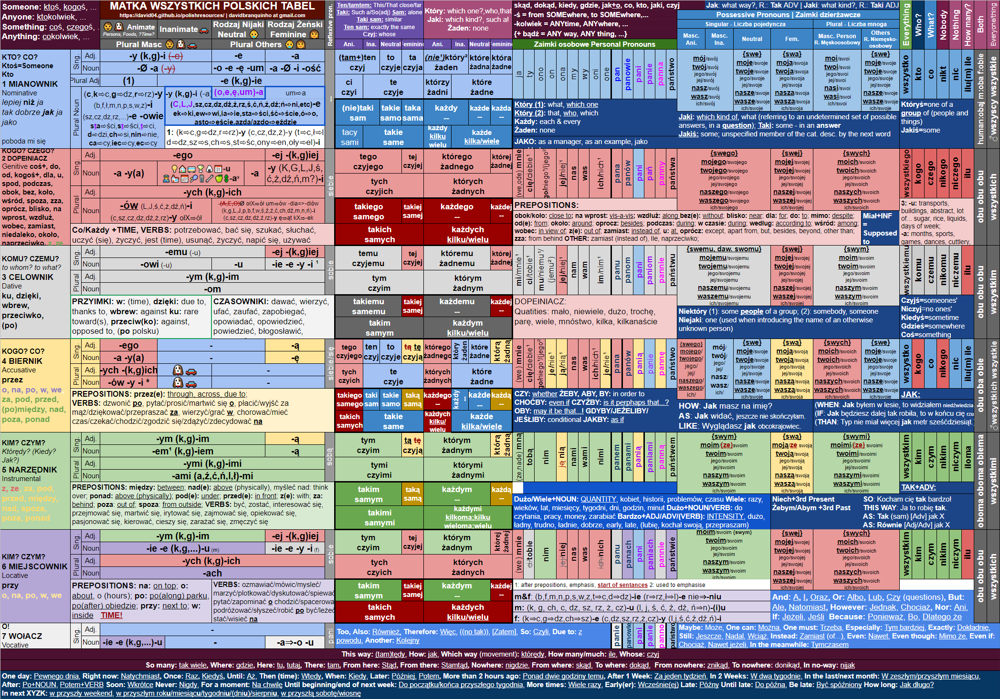

# David's Polish Resources

 * **Source Google Docs**, send me **comments and suggestions** for edits there: [https://docs.google.com/spreadsheets/d/1o8m4odWbwpr1atd6Y7ueqy-3LU2-qVPwiE5BK2rrgTk/edit?usp=sharing](https://docs.google.com/spreadsheets/d/1o8m4odWbwpr1atd6Y7ueqy-3LU2-qVPwiE5BK2rrgTk/edit?usp=sharing)

 * [Declensions & More Table](PolishNotes.pdf)

 * [Quickref](Quickref.pdf)

 * [Verbs](Verbs.pdf)

 * [Adjectives & Adverbs](AdjAdv.pdf)

 * [Imiesłow](Imieslow.pdf)

 * [Numbers](Numbers.pdf)

 * [Partykuły](Partykuly.pdf)
 
 * [Verb Prefixes](Verb Prefixes.pdf)
 
 * Contact: davidbranquinho at gmail dot com

### Special Thank You to all my tutors, in particular:

* Przemek, [Meet him here](https://www.italki.com/teacher/1166474)

* Jacek, [Meet him here](https://www.italki.com/teacher/5687854)

* Magdalena, [Meet her here](https://www.italki.com/teacher/5366273)

* Adrian, [Meet him here](https://www.italki.com/teacher/4008063)

* Paulina, [Meet her here](https://www.italki.com/teacher/4326690)

* Grzesiek, [Meet him here](https://www.italki.com/teacher/1509498)

* And many others!

### Recommended Online Resources:

* Reverso Context: For example, searching for text where the word "czytam" (I read) occurs - very helpful: [https://context.reverso.net/t%C5%82umaczenie/polski-angielski/czytam](https://context.reverso.net/t%C5%82umaczenie/polski-angielski/czytam)

* Wiktionary, we you can see the conjugation of the verb (**odmiana**, not always available), if it's perfective or imperfective, what's the perfective/or what's the imperfective (not always available): [https://pl.wiktionary.org/wiki/czyta%C4%87](https://pl.wiktionary.org/wiki/czyta%C4%87)

### Declensions & More Table in Image:

* [To download png click here](https://github.com/david04/polishresources/raw/master/Declensions.png)

